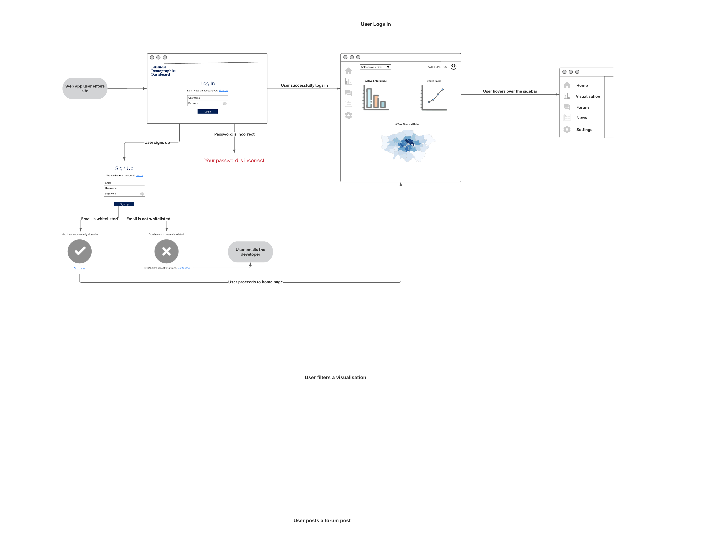

# Coursework 2

to do:

user flow
user stories
context diagram
wireframes
routes
erd 
unit tests
flake8 and black
ci worth

## Technical information
### Repository URL
[Repository](https://github.com/ucl-comp0035/coursework-1-zzoeys.git)

### Set-up instructions

No additional requirements beyond requirements.txt.

## Requirements definition and analysis

### Requirements identification methods

Firstly, a context diagram is built to gain insight into interface requirements. This is a form of interface analysis, a BABOK elicitation technique (International Institute of Business Analysis, 2015), and it enables the understanding of the users that send and receive data to and from the system at a high-level of abstraction. 

Ideally, a focus group would also be conducted with aspiring business owners to learn about their requirements for the web application. During a focus group, participants can build on the responses of others and comment on any differing opinions. This makes focus groups useful for understanding a collective view (Kitzinger, 1995) and would allow the product team to gain an understanding of the aspiring business owners’ needs and how the proposed web application can best support these needs. 

However, due to ethical and time restrictions, brainstorming will be used instead of focus groups. The context diagram will guide the process of brainstorming so that requirements of all users of the system can be identified. User stories are also added and refined as the design process is carried out, such as when more detail was added to the acceptance criteria after drawing the wireframe. For example, the acceptance criteria for a separate view to enlarge the data on the dashboard was added as design research was conducted to specify the wireframe for the dashboard. 

### Context diagram

### Requirement specification method

Data Driven Scrum (DDS) was chosen as the project methodology to guide the use of sprint planning as DDS is an agile methodology and a core principle of agile development is developing software that is user-focused. Thus, creating user stories was chosen as the method of requirement specification as they keep the product team focused on the value of their software’s features and how they address a particular need of the client (https://www.atlassian.com/agile/project-management/user-stories). User stories articulate the desired purpose of the system and provide the basis for communication and collaboration between the product team about the user’s requirements. User stories are also meant to be easily understood and revised, which is helpful for an inexperienced product team like that of this project.

### Prioritisation method

The MoSCoW prioritisation method was chosen as it complements the use of user stories and agile projects (Agile Business, 2021). Though it is simple, it is provides enough detail about 'Must Have', 'Should Have', 'Could Have' and 'Won't Have this time' requirements that help project teams set and manage priorities.

The considerations made when prioritising requirements are detailed on the Trello page linked below. They are labelled with the purple label named 'Prioritisation Considerations'. 

### Documented and prioritised requirements

Trello was used, here. Please click the labels at the top of each card to see the name of the labels.

## Design

### Design Research for Application Design

A dashboard for the data visualisations was chosen to be created as it is an accessible way of visually consolidating the most relevant information for a user to view (Subotin, 2017). To improve usability, it is important for the dashboard to include filters that enable users to customize what data is displayed. It is also important for the data to be displayed in a minimized view, but with a feature that allows users to show more details in a separate view. These features were thus added as acceptance criteria in the user stories.

### Structure and flow of the interface

#### User flows

To get a high-level model of the basic flow of the user, a user flow was created.

#### Detailed use cases

To guide the creation of the wireframes, a detailed use case was created for the process of a user signing up. The creation of a use case was guided by the acceptance criteria of the user stories, but helps to elicit more detailed acceptance criteria. For example, the feature of a developer being able to whitelist a user's emails so that only the project's clients could sign up on the site was added while drawing up the use case.

#### Wireframes

Lucidchart was used to create the wireframes for the web app. As the user of the web app would tend to use their laptops to access the app instead of other devices like their mobile phone, the sketch would assume the user is accessing the web app on their laptop.

**User or developer logs in or signs up**

**User saves a filter**

**User uses the forum**

**User reads a news articles**

**User goes to the settings page**

#### Class diagram

A class diagram was created for a high level visualisation of the model of the web application. [why create a class diagram]

A data-driven approach was chosen to identify the classes and their attributes and methods, and the relationships between the classes. This approach was chosen as it utilises analysing the user stories to draw out potential classes. Thus, when the user stories get refined throughout the development process as feedback from external stakeholders is received, it would be easier to detect how the classes would change. As a responsibility-driven approach focuses on identifying all the requirements from the start , it may not suit this project which is involves an inexperienced team so the user stories would change over time.

To create the filtering function as specified in the user stories, the Filter Pattern was chosen as the design function (Tutorials Point, 2021). It involves utilising concrete classes to implement the operations and attributes defined by the interface class. As Python does not have an 'interface' keyword unlike Java, the design pattern can still be applied by utilising different methods of creating a class with similar functions to that of an 'interface' class (Real Python, 2021). 

Criteria interface and concrete classes implementing this interface to filter list of Person objects.

Despite trying to ensure low coupling and that inheritance causes 
[why would we have an inheritance relationship]

The resulting class diagram is shown below:

<from sarah>
Conceptually this makes sense. A class diagram is a model of your application. As a model of your design intent I personally think this makes sense. You are correct in that you can't create a class of type interface in Python, you have choices (you may have already read the article but if not see https://realpython.com/python-interface/). Given that I don't know which students' coursework will be moderated, I would suggest that rather than try to modify the diagram again that you write in the markdown and explain your reasons for applying this design pattern. You can also note that the diagram is modelling the interface concept (ie that you want there to be a filter method for which the actual implementation is handled by the classes that use it) even though you are aware that there is no specific interface keyword in Python.

#### Routes

(a controller is what happens when the user goes to that view and that controller can get called when something happens in that view)

* Note: all routes except /login and /signup require the @login_required from the Flask-Login plugin (https://hackersandslackers.com/flask-routes/)

| Route | View | Controller Function |
| :----- | :----- | :----- |
| /login | 1.1 | login() Checks the entered account info against the details in the database, returns an error if details are incorrect, otherwise redirects users to the main page. |
| /signup | 1.1.1 | signup() Checks the entered email against the whitelisted emails in the database, returns an error if the email is not present, otherwise stores the login details in the database and redirects users to the main page. |
| /main | 1.2 | index() Renders the home page with the user's first saved visualisation. filter() Renders the visualisations according to the saved filter chosen by the user. enlarge() Shows the visualisation that the user clicks on in a larger pop-up.|
| /visualisation | 2.1 | filter() Renders the visualisations according to the boroughs and years selected by the user. enlarge() Shows the visualisation that the user clicks on in a larger pop-up. |
| /visualisation/create_filter | 2.1.2 | create_filter() Saves the current boroughs and years selected by the user as a saved filter under the name written by the user. |
| /forum | 3.1 | create_new() Shows a pop-up where the user can write the title and body of the forum post they want to write. read() When a user clicks on a forum post, shows a pop-up with the full contents of the forum post |
| /forum/forum_post_id/read (user's post)| 3.2 | edit() When a user clicks on the 'Edit post' button on a forum post created by them, shows a pop-up where they can edit the body of their post. comment() When a user clicks on the 'Comment' button,shows a pop-up where the users can comment on the post |
| /forum/forum_post_id/read (other user's post)| 3.3 | comment() When a user clicks on the 'Comment' button, shows a pop-up where the users can comment on the post |
| /forum/forum_post_id/comment | 3.4 | submit() When a user clicks on the 'Submit' button after writing their comment, adds the details of the comment to the database, redirects users to the post page and renders the new comment on the post page |
| /forum/create_new | 3.5 | post() When a user clicks on the 'Post' button after writing their post, adds the details of the post to the database, redirects users to the forum page and renders the new post on the forum page|
| /news | 4.1 | read() When the user clicks on a news article, shows a pop-up with the full contents of the article |
| /news/article_id/read/ | 4.1.1 |  |
| /settings |  | reset_password() |
| /whitelist |  | whitelist() Whitelists a user's email by adding their email to the database of whitelisted emails and |

### Relational database design

#### ERD

Firstly, considerations were made to ensure that the primary key of each table is an integer, so the user_id, forum_post_id, forum_comment_id and borough_id attributes were added

SQLite, the database to be used, doesn't allow data to be stored as a date-time data type, so the integer format for UNIX time is used. Boolean values are also not supported so they are stored as integers 0 (false) and 1 (true) (SQLite, 2021).

To model the database with the saved filters, instead of storing the list of boroughs and years in the saved filter as a list as modelled in the class diagram, first normalisation was performed. Storing these details as a list would mean that a table cell would have one or more values which violates the requirements for 1st Normal Form (1NF). To avoid this, two tables were created linking the filter_id of the filter to the years and borough_id's of the boroughs that are in the filter. The tables, named filter_borough and filter_year, would also solve the many-to-many relationship between saved filters, boroughs and years: one filter can have many boroughs and years and one borough/year can belong to multiple years. The resulting ERD is below:

In the process of second normalisation to 2nd Normal Form (2NF), the table borough_name was created so that the attribute borough_name is only dependent on borough_id and not the combination of filter_id and borough_id. It also avoids duplication of data as it prevents having to store the borough name every time a borough is linked to a filter. The resulting tables have no transitive functional dependencies, so the requirements for 3rd Normal Form (3NF) are satisfied. 

To model the databases for forum posts and forum comments, referential integrity is ensured so that each foreign key references an existing primary key in the parent table. These tables also satisfy the requirements for 1NF, 2NF and 3NF as shown below:

A table to store the whitelisted emails added by developers was created without any relationships with other tables. This is because the table with whitelisted emails only serves one purpose to check whether new users are authenticated by checking their emails against the list of whitelisted emails. Only once the users have signed up successfully are their details added to the user database table. As the table of whitelisted emails is still necessary to model the whole process of a user's journey while using the web app despite it having no relationships to other tables, it is still appropriate to have it [https://dba.stackexchange.com/questions/1088/is-it-ok-to-have-an-entity-in-an-er-diagram-without-a-relationship].

The resulting ERD is shown below:

#### Data dictionary

| Table | Column name | Key |  Data type | Constraint | Description |
| :----- | :----- | :----- | :----- | :----- | :----- |
| user | user_id | PK | Integer | Not null, auto increment | Unique identifer for users |
| user | username |  | Text | Not null | |
| user | name |  | Text | Can be null (like when the user has just signed up and hasn't input their name) | User's name, can be first name, last name or full name |
| user | email  |  | Text | Not null, check with regex that the email is in a valid @ and .com format | User's email that has signed up | 
| user | password  |  | Text | Not null | Hashed password |
| user | is_developer  |  | Integer | Not null, 0 for False or 1 for True | Whether a user has developer permissions  |
| forum_post | forum_post_id | PK | Integer | Not null, auto increment | Unique identifer for forum posts |
| forum_post | user_id | FK | Integer | Not null | The user id of the writer of the forum post |
| forum_post | title |  | Text | Not null | Title of the forum post |
| forum_post | body |  | Text | Not null | Body text of the forum post |
| forum_post | date_published |  | Text | Not null, stored as text as ISO8601 strings | Body text of the forum post |
| forum_comment | forum_comment_id | PK | Integer | Not null, auto increment | Unique identifer for forum comments |
| forum_comment | forum_post_id | FK | Integer | Not null | The forum post id of the post that the comment belongs too |
| forum_comment | user_id | FK | Integer | Not null | The user id of the writer of the forum comment |
| forum_post | body |  | Text | Not null | Body text of the forum comment |
| saved_filter | filter_id | PK | Integer | Not null, auto increment | Unique identifer for saved filters |
| saved_filter | saved_filter_name |  | Text | Not null | Name given by user for the saved filter |
| saved_filter | user_id | FK | Integer | Not null | The user id of the user that created the saved filter |
| filter_borough | filter_id | FK | Integer | Not null | The filter id of the filter that contains the borough |
| filter_borough | borough_id | FK | Integer | Not null | The borough id of the  borough that is included in the filter |
| borough_name | borough_id | PK | Integer | Not null, auto increment | Unique identifer for boroughs |
| borough_name | borough_name |  | Text | Not null | Name of the borough |
| filter_year | filter_id_year | PK | Integer | Not null, auto increment | Unique identifer for the combination of the filter id and year that is included in the filter |
| filter_year | filter_id | FK | Integer | Not null | The filter id of the filter that contains the year |
| filter_year | year |  | Integer | Not null, YYYY format | The year that is included in the filter |
| whitelisted_email | whitelisted_id | PK | Integer | Not null, auto increment | Unique identifer for the whitelisted email |
| whitelisted_email | whitelisted_email |  | Email | Not null, check with regex that the email is in a valid @ and .com format | User's email that has been whitelisted | 

## Testing

### Choice of unit testing library

Pytest was chosen because it is simpler to use and unlike unittest, doesn't [require creating classes and defining the testing functions within that class]
scalable and simple tests
[https://www.pythonpool.com/python-unittest-vs-pytest/]

Accessibilty of testing using selenium axe [https://pypi.org/project/axe-selenium-python-dev/]
The code is in the file test_accessibility, however, it cannot be run as geckodriver has to be installed on Firefox [https://www.guru99.com/gecko-marionette-driver-selenium.html] When the webpage has been launched, this will be added

Process of checking for bugs in the project development stage
https://www.mitchlacey.com/blog/managing-bugs-in-scrum-and-agile-projects/

### Tests

Though it is not necessary to cite official documentation, I thought it would be useful to link the relevant pages as they were heavily consulted. 

Pages in the pytest documentation were referenced to [parametrize the tests](https://docs.pytest.org/en/latest/how-to/parametrize.html), to [pass a fixture as a value in parametrized tests](https://docs.pytest.org/en/latest/example/parametrize.html#indirect-parametrization) and to apply [conditional raising in a parametrized tests](https://docs.pytest.org/en/stable/example/parametrize.html#parametrizing-conditional-raising) so that it can be tested if an error is raised when specific values are passed in a parametrized test.

Automated web accessibility testing using aXe and selenium is to be performed once the web app page is running. It cannot currently be performed because there is no url. Once the web page has a url, [geckodriver for Firefox](https://pypi.org/project/axe-selenium-python/) will also be installed so that the test can run. The file with the code for the accessibility testing is in the tests folder for reference, but when running the test please use the commands `python -m pytest -v tests/test_user.py` and `python -m pytest --cov=user tests/test_user.py` to only run the tests and see the coverage report for the test_user file as the test_accessibility file would result in errors. 

### Test results

When running `python -m pytest -v tests/test_user.py`:

When running `python -m pytest --cov=user tests/test_user.py`:

#### Code quality

To ensure code quality, standard conventions for Python from PEP8, PEP257 were used

The flake8 linter through Github Actions found that the code did not adhere to style guides.

The Black  Python code reformatter[https://pypi.org/project/black/] was used for to ensure that PEP 8 conventions were followed for the user.py and data_preparation.py files.

### Continuous integration 
Consider using GitHub Actions (or other) to establish a continuous integration pipeline. If you do so then please provide a link to the .yml and a screenshot of the results of a workflow run.

[consider the benefits of using such tools in the development phase of a project]

As with the Python Application workflow on Github Actions, the flake8 linter was run. 

## References

Agile Business, 2021. 10 Moscow Prioritisation - Agile Business. Agile Business Consortium. Available at: https://www.agilebusiness.org/page/ProjectFramework_10_MoSCoWPrioritisation [Accessed December 19, 2021]. 

International Institute of Business Analysis. (2015). A Guide to the Business Analysis Body of Knowledge (Babok Guide). International Institute of Business Analysis. 

Kitzinger, J., 1995. ‘Qualitative Research: Introducing focus groups’. BMJ, 311(7000), pp.299–302. Available at: <https://www.bmj.com/content/311/7000/299.short?casa_token=uJ4gtahRwrAAAAAA:2k59gth8O5qcSTJ9OTiid4f8Gu-u5oXe8svsPsgYXGLltwIUv0kjsTXThj-n-lAxUbHrtoeofWQ4> [Accessed Nov 24, 2021]. 

Real Python, 2021. Implementing an interface in Python. Real Python. Available at: https://realpython.com/python-interface/ [Accessed December 19, 2021]. 

SQLite, 2021. Datatypes in SQLite. Datatypes In SQLite. Available at: https://www.sqlite.org/datatype3.html [Accessed December 19, 2021]. 

Subotin, S., 2017. Dashboard Design - Considerations and Best Practices. Designers. Available at: https://www.toptal.com/designers/data-visualization/dashboard-design-best-practices [Accessed December 13, 2021]. 

TutorialsPoint https://www.tutorialspoint.com/design_pattern/filter_pattern.htm 