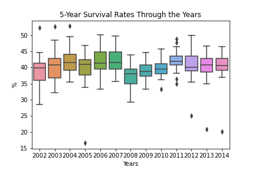

# Coursework 1

## Technical information
### Repository URL
[Repository](https://github.com/ucl-comp0035/coursework-1-zzoeys.git)

### Set-up instructions

No additional requirements beyond requirements.txt.

## Selection of project methodology
### Methodology (or combination) selected

Team Data Science Process and Data Driven Scrum

### Selection criteria and justification of selection

Selection criteria:
* Covers both software development and data science methods
* Easy to learn or well documented
* Flexible 

Team Data Science Process (TDSP) is a modern and agile lifecycle for data science project teams where the deliverable is a data science product (Data Science Process Alliance, 2021a). It provides an interative framework starting from business understanding, where objectives and data sources are defined, to customer acceptance, where the customer validates their satisfaction with the product. As this project involves creating a web application with data visualisations, there is a software engineering and data science aspect of the project. TPDS addresses both these aspects and effectively combines the roles, considerations and skills involved in a typical software engineering and data science processes. In addition, TPDS clearly defines team roles and utilises a standardised project structure with a version control system. This would be beneficial for an inexperienced project team as team members have fixed responsibilities and a version control system which would facilitate collaboration. Thus, TDSP is an appropriate methodology to choose for this project.

Another benefit of using TDSP is that the methodology is well documented (Microsoft, 2021a), which would greatly help the inexperienced team to learn the process. As the product team is formed of developers with little to no experience in the use of software engineering or data science process models, it is assumed that they would be heavily relying on the official documentation. However, the TPDS documentation explains sprint planning and adding items to product backlogs using Microsoft Azure Boards (Microsoft, 2021b), which the product team might not choose to use. Sprint planning forms a key part of the day-to-day tasks of the product team, so it is important to have easily understandable process.

To address this shortcoming of TDSP, Data Driven Scrum (DDS) will be used to guide the use of sprint planning. DDS incorporates the advantages of Scrum, such as the use of daily stand-up and retrospectives, which ensure smooth collaboration within teams (Data Science Process Alliance, 2021b). However, DDS is more flexible than traditional Scrum as DDS sprints don't have a fixed length while tradition Scrum and TDSP utilise fixed sprint durations. This would be beneficial to this specific project team as the project involves software engineering and data science. Depending on what aspect the project is being worked on, sprint duration and can be extended or shortened to better suit the team. 

DDS also integrates the visual and continuous aspect of Kanban which guides the collaborative process of product or data science teams (Data Science Process Alliance, 2021b). From my own experience working in a software development team, Kanban boards are easy and simple to learn so an inexperienced team, like that of this project, can pick up on it quickly. 

Therefore, TDPS was chosen to provide a high-level methodology to aid business understanding through customer acceptance, while DDS will be used instead of the sprint planning process in the TDPS documentation. Though it may be confusing to use methodologies, the flexibility of DDS makes up for this as there is room to try the methodologies and adapt to what suits the team best. 

## Definition of the business need
### Problem definition

Aspiring business owners looking to find a location in London to start their business struggle to find the most appropriate area that would give their business the best chance for survival. With 60% of businesses failing within the first three years (May, 2019), it is important for aspiring business owners to do what they can to ensure their business has the best chance of long-term survival. Past research has shown that the location of a business plays a crucial factor in determining its survival chances (Fritsch et al., 2006). This is because important factors of business survival, such as access to labour markets, specialised services and customers, are related to the location of the startup. For example, choosing an area with lower economic activity might hinder the startup’s access to these important resources, making it harder for the startup to sustain itself after launch and decreasing its chances of survival. Thus, founders are faced with the important decision of choosing the most suitable location to launch their business and require the relevant data to enable them to make an informed decision. 

Having to consider all these different factors may be difficult and time-consuming, especially when aspiring business owners don't have a background in entrepreneurship. In particular, London is one of the most popular places in the world for startups (Gauthier, 2021). However, different areas in london differ in the support they can offer startups. Thus, it would be much faster and more convenient to analyse past data on survival rates of businesses in different areas as this would shed light on whether the area is conducive for the survivability of startups. 

As clients often have little experience working with data, the relevant data has to be processed and easily visualised in a way that is accessible to the client. The available dataset to be used consists of the number of new enterprises started each year in each borough in London from 2002 to 2018 and the percentage of these new enterprises that were still alive one, two, three, four and five years later. 

This data will be cleaned and explored to produce a web application with visualisations based on data about the survival rates of different boroughs in London. This would allow the client to better make a decision about where they should launch their startup.

### Target audience

[Persona](Persona.pdf)

### Questions to be answered using the dataset

Ultimately, the question to be answered is 'Which borough in London is the best place to start a business?' To answer this question using the available dataset, the following questions will be answered:

- Based on data on past years, which borough has the highest 5-year survival rate?
- Are there any general trends with regard to 5-year survival rates?
- Which boroughs have the highest economic activity, indicated by the number of active enterprises?
- Which boroughs have the lowest death rates?

5-year survival rates were chosen to be looked at as a business is always striving to survive long-term and this was the longest survival rate period that the dataset provided. It is also important to look at the general trends as we are using past data that may reflect vastly different economic situations that cause survival rates across all boroughs to vary from those from recent years. The number of active enterprises and death rates should be looked at as they shed light on the economic activity of the area. This data is also more recent as it goes up to the year 2019, while we can only get 5-year survival rates up to the year 2014, so they may provide a more recent perspective on current economic situations.

## Data preparation and exploration
### Data preparation

[Data Preparation](data_preparation.py)

 

[Data Preparation Notebook](data_preparation_notebook.ipynb)

The Python file has only the necessary code to produce the prepared dataset. The Jupyter notebook has all the steps taken in the process of understanding and preparing the dataset, along with explanations on why these steps were taken.

### Prepared data set
The given link contains three dataset files. However, only the first was chosen to be used as the data from the other two are included in the first dataset.

[Original data set](data/business-demographics.xlsx)

 

[Prepared data set](data/prepared_data.xlsx)

### Data exploration

[Data Exploration Notebook](data_exploration_notebook.ipynb)

 The Jupyter notebook has all the steps taken in the process of exploring the dataset, along with explanations on why these steps were taken.

### Images

## Weekly progress reports
### Report 1

What I did in the last week:
* Learned about different software engineering and data science process methodologies and what considerations should be made when selecting the appropriate model for a project.
* Wrote down points about the coursework question on the target audience, experience of the team in these methodologies, business goals and problems.
* Read up in-depth on Agile, Scrum, Data Driven Scrum and Team Data Science Process.

What I plan to do in the next week:
* Finalise a methodology to use.
* Draft a persona and problem statement.
* Brainstorm questions that can be explored with the data set.

Issues blocking my progress (state ‘None’ if there are no issues):
* I am unsure whether we should choose a more data science focused methodology or a software engineering one.

### Report 2

What I did in the last week:
* Finalised the use of Data Driven Scrum and Team Data Science Process as the coursework methodology.
* Learned the key purposes of a problem statement and drafted a problem statement for the coursework question.
* Started to draft the persona to describe the users for the web application.
* Came up with a question that can be explored with the dataset (Which boroughs in London have the best survival rates for new enterprises?)

What I plan to do in the next week:
* Finish drafting the persona.
* Write the justification of the methodologies chosen.
* Edit the problem statement based on feedback from PGTAs and peers.
* Prepare data using pandas and explore different data visualisations.

Issues blocking my progress (state ‘None’ if there are no issues):
* Unsure whether we should describe a specific client in the problem statement and persona or make it more general. For example, as my dataset has to do with businesses and the target user of my web application will be aspiring business owners trying to find a location for their business, I'm unsure whether I should make the persona as 'aspiring business owners' or come up with just one person to embody this group.

### Report 3

What I did in the last week:
* Learned how to prepare and explore data using pandas.
* Explored the dataset (8 Business).
* Worked on drafting the persona, editing problem statement based on feedback from peers and writing a justification of the methods chosen.

What I plan to do in the next week:
* Commit work done to the repository.
* Continue exploring the dataset to see what questions can be answered from it.
* Come up with more questions that can be answered with the dataset or sub questions for the question 'Which boroughs in London have the best survival rates for new enterprises?'

Issues blocking my progress (state ‘None’ if there are no issues):
* None.

### Report 4

What I did in the last week:
* Continue preparing the dataset on survival rates, active enterprises and death rates by removing irrelevant columns, deleting empty rows from the sheets and making sure there are no empty cells.
* Started exploring the dataset by trying to analyse outliers from box plots.

List what you plan to do next week (for the coursework project):
* Finish the coding section and commit work to GitHub.
* Finish uploading all previous sections to GitHub.

Issues blocking my progress (state ‘None’ if there are no issues):
* Had some issues with my laptop which makes the laptop very laggy whenever Visual Studio Code is run. Have tried writing code on other platforms then copying it over. 

## References
Anon, 2021. London maintains its Crown as one of the world's top startup hubs. London and Partners News. Available at: https://media.londonandpartners.com/news/london-maintains-its-crown-as-one-of-the-worlds-top-startup-hubs [Accessed October 24, 2021]. 

Data Science Process Alliance, 2021b. Data Driven Scrum. Data Science Process Alliance. Available at: https://www.datascience-pm.com/data-driven-scrum/ [Accessed October 22, 2021]. 

Data Science Process Alliance, 2021a. Team Data Science Process (TDSP). Data Science Process Alliance. Available at: https://www.datascience-pm.com/tdsp/ [Accessed October 22, 2021]. 

Dunsby, M., 2021. Where is the London location to start a business?: Startups. Startups. Available at: https://startups.co.uk/analysis/where-is-the-best-place-in-london-to-start-a-business/ [Accessed October 24, 2021]. 

Fritsch, M., Brixy, U. &amp; Falck, O., 2006. The effect of industry, region, and time on New Business Survival – a multi-dimensional analysis. Review of Industrial Organization. Available at: https://link.springer.com/article/10.1007/s11151-006-0018-4 [Accessed October 24, 2021]. 

May, R., 2019. Start-ups across the UK are going bust - they need more careful management for our economy to boom. The Telegraph. Available at: https://www.telegraph.co.uk/politics/2019/01/24/start-ups-across-uk-going-bust-need-careful-management-economy/ [Accessed October 24, 2021]. 

Microsoft, 2021b. Assign backlog items to a sprint. Available at: https://docs.microsoft.com/en-us/azure/devops/boards/sprints/assign-work-sprint?view=azure-devops [Accessed October 24, 2021]. 

Microsoft, 2021a. What is the team data science process? Azure Architecture Center. Available at: https://docs.microsoft.com/en-us/azure/architecture/data-science-process/overview [Accessed October 22, 2021]. 